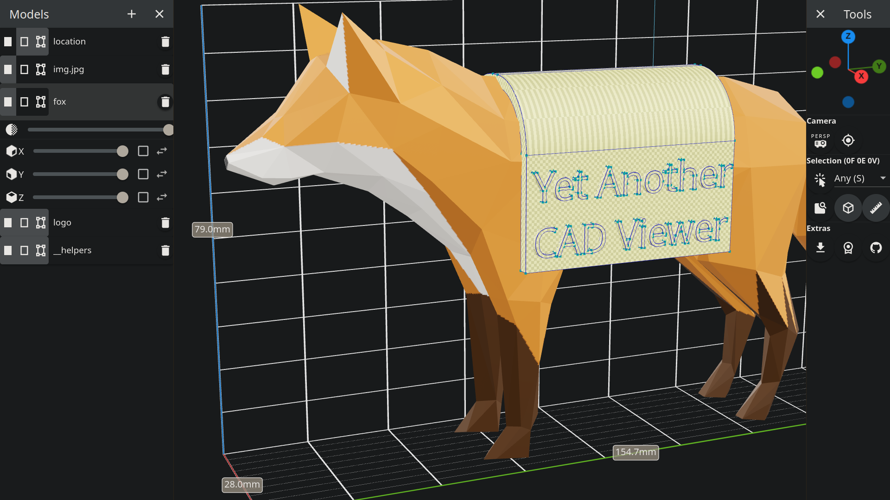

# Yet Another CAD Viewer

A CAD viewer capable of displaying [OCP](https://github.com/CadQuery/OCP)
models ([CadQuery](https://github.com/CadQuery/cadquery)/[Build123d](https://github.com/gumyr/build123d)/...)
in a web browser.

## Features

- Cross-platform: works on any modern web browser.
- All [GLTF 2.0](https://www.khronos.org/gltf/) features (textures, PBR materials, animations...).
- All [model-viewer](https://modelviewer.dev/) features (smooth controls, augmented reality...).
- Load multiple models at once, load external models and even images as quads.
- Control clipping planes and transparency of each model.
- View and interact with topological entities: faces, edges, vertices and locations.
- Select any entity and measure bounding box size and distances.
- Hot reloading while editing the CAD model (using the `yacv-server` package).
- Fully-featured static deployment: just upload the viewer and models to your server.

## Usage

The [example](example) is a fully working project that shows how to use the viewer.

You can play with the latest
demo [here](https://yeicor-3d.github.io/yet-another-cad-viewer/?preload=logo.glb&preload=logo_hl.glb&preload=fox.glb&preload=img.jpg.glb&preload=location.glb)
(or
[without animation](https://yeicor-3d.github.io/yet-another-cad-viewer/?autoplay=false&preload=logo.glb&preload=logo_hl.glb&preload=fox.glb&preload=img.jpg.glb&preload=location.glb)).

## Related projects

- [cq-studio](https://github.com/ccazabon/cq-studio) provides an alternative workflow that detects file changes instead
  of relying on an interactive environment like Jupyter for hot-reloading.
  Uses the same backend and frontend behind the scenes.
- [build123d-docker](https://github.com/derhuerst/build123d-docker/pkgs/container/build123d) provides docker images for Yet Another CAD Viewer and other projects, with automatic updates.
